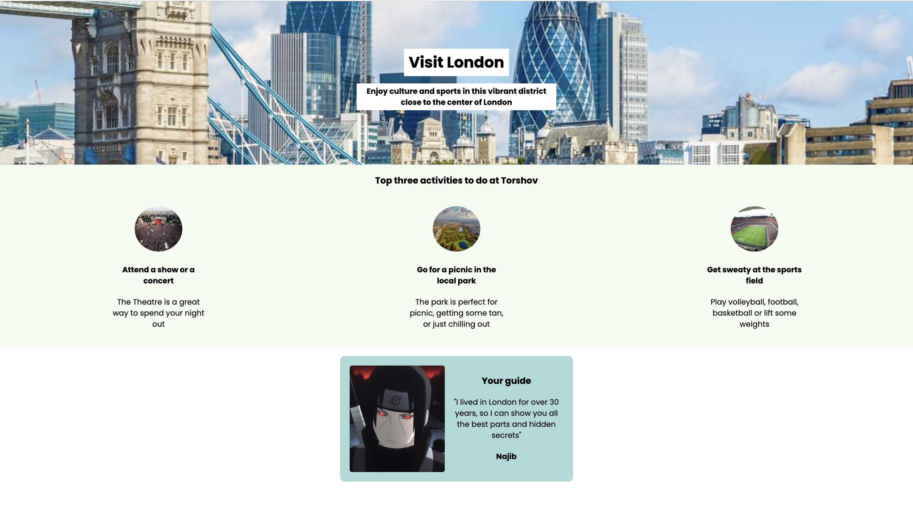

# Hometown 

Welcome to the Hometown project! This project represents a simple website layout for showcasing the vibrant district of London, England. It highlights the top activities to do in the area and introduces a local guide.

## Description

This website displays a hero section with a title and description, showcasing the district's charm. It also features a section dedicated to the top three activities to do in the area, complete with images and descriptions. Additionally, there is a guide section that introduces a local guide with their photo and a brief bio.

## Lessons Learned

2. **Background Images**: Utilizing background images to create visually appealing hero sections and sections.
3. **Flexbox Layout**: Implementing a flexbox layout for aligning and spacing content elements.
4. **Google Fonts Integration**: Integrating Google Fonts for enhancing the website's typography and overall visual appeal.
5. **CSS Styling**: Applying various CSS styles, such as padding, margins, and colors, to create a cohesive and visually appealing design.

## Ideas for Improvement

1. **Interactive Map**: Incorporate an interactive map to showcase the district's location and nearby attractions.
2. **Additional Sections**: Add more sections to provide information about local restaurants, accommodations, and transportation options.
3. **Image Gallery**: Implement an image gallery to showcase more visuals of the district and its attractions.
4. **User Reviews**: Include a section for user reviews and testimonials about the district and the local guide.
5. **Accessibility**: Ensure the website meets accessibility standards by providing alt text for images and ensuring keyboard navigation.

## Technologies Used

- HTML
- CSS

## Installation

1. Clone this repository: `git clone https://github.com/your-username/hometown.git`
2. Open `index.html` in your web browser.

## Live Demo

Check out the Hometown website [here](https://hometown-tan.vercel.app/)

## Contributing

Contributions are welcome! If you have suggestions for improvement or want to add new features, please open an issue or submit a pull request.

## License

This project is licensed under the [MIT License](LICENSE).

**Author:** [Najib](https://github.com/najibdevs)
**Date:** May 12, 2024